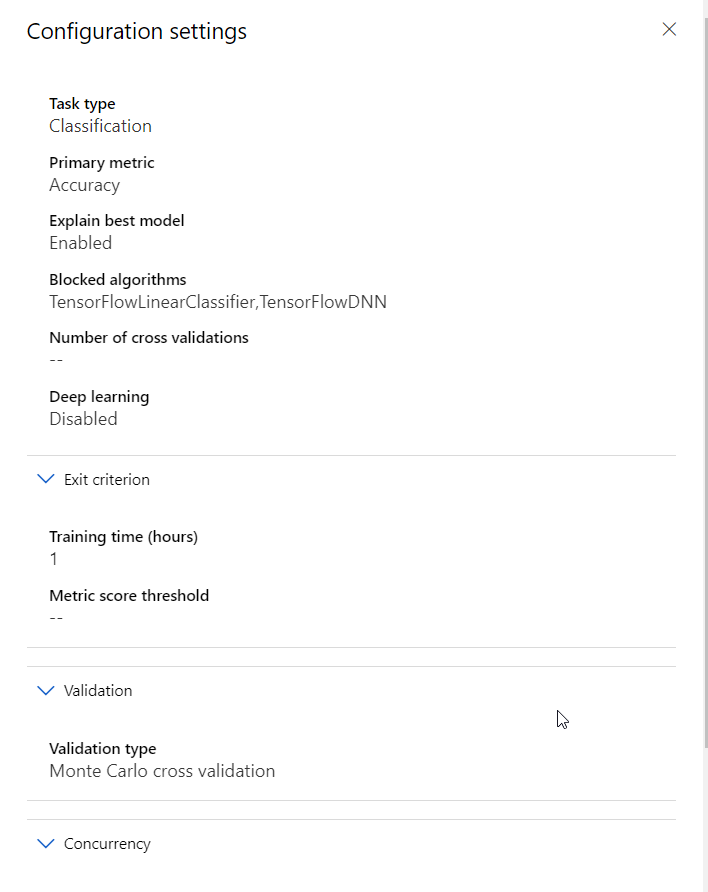
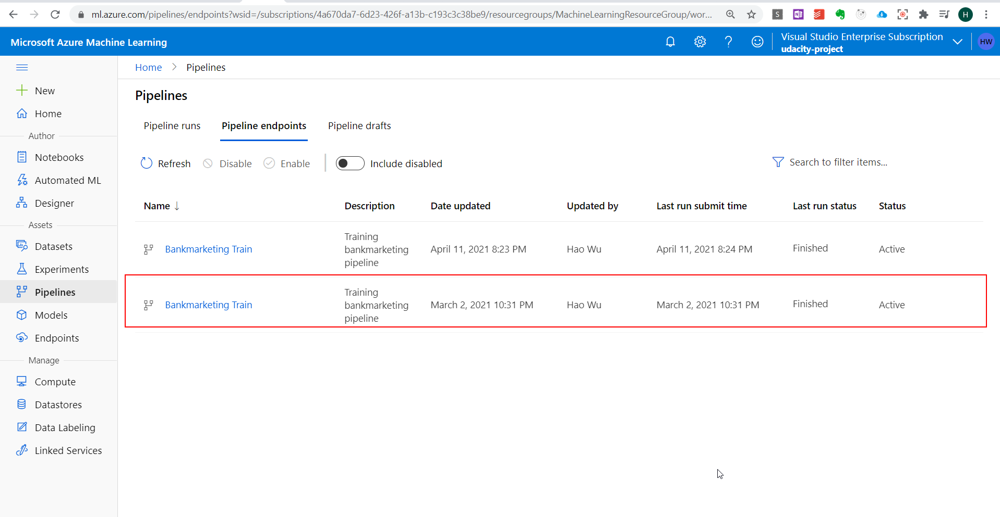

# Operationalizing Machine Learning

In this project, we use Bank Marketing dataset to train a machine learning model using AutoML. And then deploy the model using ACI to make it accessible via REST API. 

## Architectural Diagram

The architetcure of the project is as indiacted in the diagram below:
 

## Key Steps

### Deploy model in Azure ML Studio
1. Configure Sevice Principal authentication on my own Azure portal, and use 'az ml workspace share' command to assign access to your role;

2. Register dataset, in this case it is Bankmarketing dataset from bankmarketing_train.csv;

3. Configure the AutoML task, such as VM size, experiment type (which is Classification in this case), as well as Exit Criterion, etc.;

4. Run the AutoML task to get the best model;

5. Select the best ML model, and deploy it using ACI;

6. (option) Use swagger to generate the web-based API document for easy reference;

7. Enable logging and Application insight to monitor the performance of the deployed model;
 

8. Write python code to consume the REST API to do prediction;

### Publish an ML Pipeline
In this step, we are using python to create and publish the pipeline, whose detail is shown in below images:
1. Pipeline scheduled run details

2. Pipeline is created successfully

3. Pipeline REST endpoint in active state

## Screen Recording
The screen recording is here:
https://www.youtube.com/watch?v=TXPAT7qJ-FA

## Standout Suggestions
For now it is just a REST Web API. So it would be better to have a user interface. It could be web based or mobile based. No matter which one is chosen, we can make use of Azure platform to do all the server side job. With the help of the user interface, normal user will be able to use the pipeline to do analysis and prediction. 
